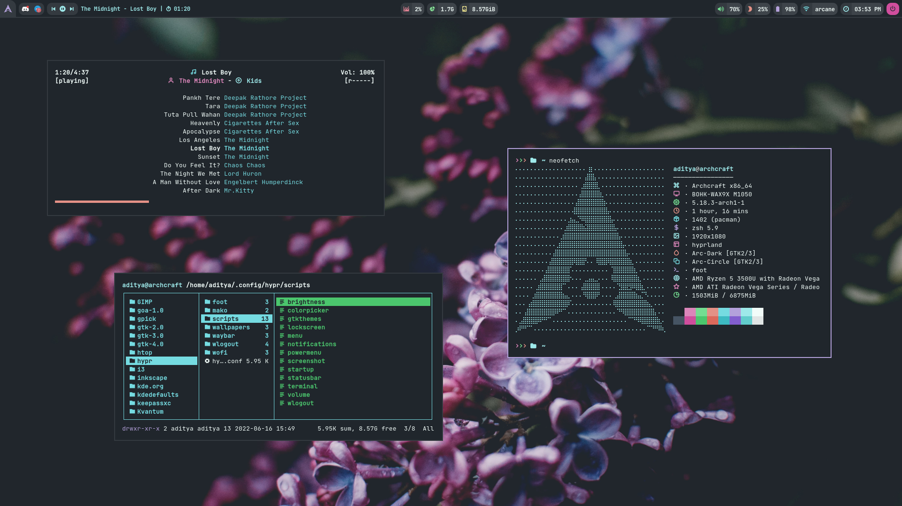

## Overview


<h1 align="center">HYPRLAND</h1>

[](https://youtu.be/t6Zd2F7rtPw)


This is heavily inspired by Archcraft-os/hyprland but with an emphaiss on customization. 

---

## Overview

[Hyprland](https://github.com/vaxerski/Hyprland) is a dynamic tiling Wayland compositor based on wlroots that doesn't sacrifice on its looks.

- **Operating System** : `Archcraft`
- **Window Manager** : `Hyprland`
- **Status Bar** : `Waybar`
- **Launcher** : `Wofi`
- **Session Manager** : `Wlogout`
- **Notifications** : `Mako`
- **Terminal** : `Foot`
- **File Manager** : `Thunar`
- **Text Editor** : `Geany`
- **Web Browser** : `Firefox`

## Installation
- **Get the files from** : [Ko-fi :coffee:](https://ko-fi.com/s/71d0e298d9) <sup>[**`Why Paid`**](https://github.com/adi1090x/adi1090x/blob/master/WHY.md)</sup>
- Extract The file **hyprland.tar.gz** with : `tar -xzvf hyprland.tar.gz`
- If you are using **`Archcraft`** as your OS, You can just install one of the provided package with : `sudo pacman -U archcraft-hyprland-1.0-2-any.pkg.tar.zst` or `sudo pacman -U archcraft-hyprland-catppuccin-1.0-2-any.pkg.tar.zst` whichever style you like.
- If you want to install this setup on _Arch Linux_ or on any _other distro_, follow the points below :
  - Install the following programs on your computer: [`hyprland`](https://github.com/vaxerski/Hyprland), `swaybg` `swayidle` `swaylock` `wlroots` `wl-clipboard` `waybar` `wofi` `foot` `mako` `grim` `slurp` `wf-recorder` `light` `yad` `thunar` `geany` `mpv` `mpd` `mpc` `viewnior` `imagemagick` `xfce-polkit` `xorg-xwayland`
  - After installing programs above, Create hypr directory in **`~/.config`** : `mkdir -p ~/.config/hypr`
  - Copy Everything from _`dotfiles/STYLE`_ to **`~/.config/hypr`** : `cp -r ./dotfiles/dark/* ~/.config/hypr/` 
  - Logout and login to your amazingly configured Hyprland WM.

> If you don't want to build hyprland, You can install **compiled hyprland binaries** provided in `dotfiles/hypr-bin`
>```
>sudo install -Dm 755 dotfiles/hypr-bin/hyprctl /usr/bin/hyprctl
>sudo install -Dm 755 dotfiles/hypr-bin/Hyprland /usr/bin/Hyprland
>sudo install -Dm 755 dotfiles/hypr-bin/libwlroots.so.11032 /usr/lib/libwlroots.so.11032
>sudo install -Dm 644 dotfiles/hypr-bin/hyprland.desktop /usr/share/wayland-sessions/hyprland.desktop
>```

### Appearance
